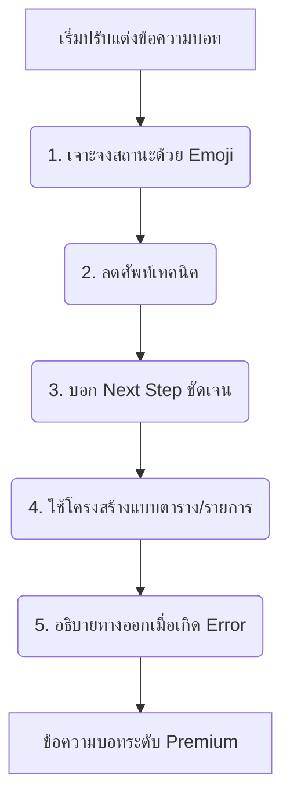

# 🧭 คู่มือและมาตรฐานการปรับแต่งข้อความบอท (Bot Message Polishing Guide)
*สร้างประสบการณ์ใช้งานที่ง่าย ตรงประเด็น และลดดราม่า สำหรับระบบจัดการแก๊ง GANG-MANAGER (FiveM SaaS)*

---

> [!NOTE]  
> เอกสารฉบับนี้จัดทำขึ้นเพื่อให้ทีมนักพัฒนาและผู้ออกแบบเนื้อหา (Copywriter) ใช้เป็นมาตรฐานเดียวกันในการเกลาข้อความ (Polish) ฝั่ง Discord Bot เพื่อให้ผู้ใช้ (หัวหน้าแก๊ง, ฝ่ายบัญชี, และสมาชิกแก๊ง) เข้าใจระบบการทำงานได้ทันที ไม่เกิดความสับสน และรู้สึกถึงความเป็นมืออาชีพของแพลตฟอร์ม

---

## 1. วิสัยทัศน์และโทนเสียงของบอท (Tone of Voice & Design Vision)

ระบบจัดการแก๊ง FiveM ไม่ใช่ระบบองค์กรทั่วไป แต่เป็นเครื่องมือที่มีความเป็น **"กึ่งทางการ ผสมความเป็นเกมเมอร์ระดับมืออาชีพ"** น้ำเสียงของบอทจึงต้องมีคุณลักษณะดังนี้:

*   **กระชับและเป็นระเบียบ (Dense & Actionable):** หลีกเลี่ยงข้อความที่ยาวเป็นพรืด สมาชิกแก๊งอ่านข้อความบน Discord ผ่านมือถือเป็นส่วนใหญ่ ข้อความต้องสั้น ได้ใจความ และชี้ทางสว่างทันทีว่าต้องกดปุ่มไหนต่อ
*   **เป็นมิตรแต่มีอำนาจตรวจสอบได้ (Empathetic but Auditable):** ใช้คำพูดที่ให้เกียรติแต่ชัดเจนในแง่กฎเกณฑ์ เช่น การเงินค้างชำระ หรือการลาที่รออนุมัติ เพื่อลดข้อพิพาทและดราม่าภายในแก๊ง
*   **ปราศจากภาษาโปรแกรมเมอร์ (Zero Technical Jargon):** ห้ามแสดงข้อความอย่าง `null`, `undefined`, `Error 500`, `SQL Exception` หรือคำศัพท์ที่เข้าใจยากบนหน้าจอของผู้ใช้ ให้เปลี่ยนเป็นภาษามนุษย์ที่แนะนำวิธีแก้ปัญหาเสมอ

---

## 2. กฎเหล็ก 5 ข้อในการเขียนข้อความบอท (5 Golden Rules)

หากต้องการเขียนหรือปรับแต่งข้อความในระบบบอท ให้ยึดหลักเกณฑ์ 5 ข้อนี้เสมอ:



### 1) เจาะจงสถานะด้วย Emoji ทุกครั้ง
ใช้ Emoji นำหน้าหัวข้อสำคัญเสมอเพื่อช่วยในการกวาดสายตา (Visual Scanning) และช่วยให้ผู้ใช้รับรู้ประเภทข้อความได้ทันทีโดยไม่ต้องอ่านจนจบ

### 2) ห้ามใช้คำศัพท์แนว Developer (Developer-Speak)
*   ❌ **ไม่ดี:** `Database query failed. User ID not found in Gang collection.`
*   ✅ **ดีกว่า:** `🚫 **ไม่พบข้อมูลสมาชิกนี้ในระบบ**\n*กรุณาตรวจสอบว่าสมาชิกได้กดปุ่มลงทะเบียนในห้อง <#ลงทะเบียน> แล้วหรือยัง*`

### 3) ต้องบอกขั้นตอนถัดไปเสมอ (Next-Step Rule)
เมื่อผู้ใช้ทำรายการใดรายการหนึ่งสำเร็จ หรือไม่สำเร็จ อย่าหยุดแค่รายงานผล แต่ต้องระบุด้วยว่าระบบทำอะไรให้แล้ว หรือเขาต้องทำอะไรต่อ
*   ❌ **ไม่ดี:** `ลบสมาชิกออกจากแก๊งสำเร็จ`
*   ✅ **ดีกว่า:** `✅ **ถอนชื่อสมาชิกออกจากระบบแก๊งเรียบร้อยแล้ว**\n\n📌 **สิ่งที่จะเกิดขึ้นถัดไป:**\n- ยศ Discord ของสมาชิกรายนี้จะถูกถอนออกโดยอัตโนมัติ\n- ประวัติการเงินและการเข้างานทั้งหมดจะถูกเก็บบันทึกในคลังเอกสารเก่า (Archive)`

### 4) ใช้โครงสร้างแบบตารางหรือรายการ (Structured Layout)
สำหรับตัวเลขหรือข้อมูลที่มีความเกี่ยวข้องกันหลายค่า ให้จัดกลุ่มโดยใช้ Markdown Bold ร่วมกับ Code Block (` `) หรือตาราง เพื่อให้ข้อมูลไม่ปะปนกัน
*   ❌ **ไม่ดี:** `คุณฝากเงิน 50000 บาท ค่าธรรมเนียม 5000 บาท ได้รับเครดิตกองกลาง 45000 บาท ยอดเงินรวม 200000 บาท`
*   ✅ **ดีกว่า:**
    > **💸 แจ้งฝากเงินกองกลางสำเร็จ**
    > *   **ยอดฝากดิบ:** `50,000` EXP
    > *   **หักค่าธรรมเนียมแก๊ง:** `5,000` EXP *(10%)*
    > *   **เงินเข้าสุทธิ:** `45,000` EXP
    > 
    > 💰 **ยอดกองกลางคงเหลือสะสม:** `200,000` EXP

### 5) เผยทางออกเสมอเมื่อเกิด Error (Solution-Oriented Error)
ทุกครั้งที่เกิดข้อผิดพลาด ต้องแจ้ง 3 อย่าง: **เกิดอะไรขึ้น + เพราะอะไร + ต้องแก้ไขอย่างไร**
*   ❌ **ไม่ดี:** `ไม่สามารถทำรายการได้ ยอดเงินกองกลางไม่พอ`
*   ✅ **ดีกว่า:** 
    > 🚫 **ไม่สามารถอนุมัติรายการถอนเงินได้**
    > 
    > **สาเหตุ:** ยอดเงินในกองกลางคงเหลือต่ำกว่ายอดที่ยื่นขอถอน
    > *   ยอดเงินกองกลางปัจจุบัน: `15,000` EXP
    > *   ยอดที่ต้องการถอน: `25,000` EXP
    > *   จำนวนที่ขาด: `10,000` EXP
    > 
    > 💡 **ทางออก:** แอดมินสามารถยกเลิกคำขอนี้ หรือแจ้งให้สมาชิกแก๊งฝากเงินสมทบก่อนกดอนุมัติอีกครั้ง

---

## 3. ระบบสีและสัญลักษณ์สากล (Global Visual Standards)

การใช้สีและสัญลักษณ์ที่สอดคล้องกันทั้งระบบ ช่วยลดความสับสนได้มากกว่า 80% เพราะผู้ใช้จะเริ่มสร้าง **"ความทรงจำเชิงภาพ (Visual Association)"** เมื่อเห็นสีเหล่านั้น:

### 🟢 3.1 มาตรฐานสี Embed ของ Discord

| สถานะ | ความหมาย | รหัสสี (Hex) | ตัวอย่างการใช้งาน |
| :--- | :--- | :--- | :--- |
| **สำเร็จ (Success)** | การอนุมัติ, บันทึกสำเร็จ, ทำรายการผ่าน | `0x2ECC71` (เขียว) | แจ้งฝากเงินสำเร็จ, อนุมัติวันลา, ลงทะเบียนผ่าน |
| **ล้มเหลว (Danger)** | ข้อมูลไม่ถูกต้อง, ข้อผิดพลาดร้ายแรง, ปฏิเสธคำขอ | `0xE74C3C` (แดง) | ปฏิเสธคำขอยืมเงิน, ยอดไม่พอ, สมาชิกค้างจ่ายนานเกินกำหนด |
| **รอการดำเนินการ (Warning)** | รอแอดมินอนุมัติ, รายการอยู่ระหว่างประมวลผล | `0xF39C12` (ส้ม) | ส่งคำขอลารออนุมัติ, สมาชิกแจ้งถอนเงินรอฝ่ายบัญชีตรวจสอบ |
| **ข้อมูลทั่วไป (Info)** | เมนูบอท, การแสดงคู่มือช่วยเหลือ, การตั้งค่าแก๊ง | `0x5865F2` (น้ำเงิน Discord) | หน้า `/help`, หน้าแสดงสถานะการเงินรวม, ข้อมูลโปรไฟล์ |

### 🧭 3.2 สัญลักษณ์นำสายตา (System-wide Icons)

*   🧭 **ระบบนำทาง/ความช่วยเหลือ:** `🧭` (Help / Settings / Setup)
*   💸 **ธุรกรรมการเงิน:** `💸` (ฝากเงิน / เบิกเงิน)
*   💳 **เครดิต / หนี้ยืม:** `💳` (ยืมเงิน / ใช้หนี้ / สำรองจ่าย)
*   💰 **ยอดคงเหลือ / กองกลาง:** `💰` (Balance / Treasury)
*   📝 **ระบบลงทะเบียน / เช็คชื่อ:** `📝` (Register / Attendance / Roll call)
*   ⏳ **รออนุมัติ / ค้างส่งงาน:** `⏳` (Pending approvals / Active requests)
*   🚫 **ปฏิเสธ / ล้มเหลว:** `🚫` หรือ `❌` (Failed / Unauthorized)
*   ✅ **อนุมัติ / สำเร็จ:** `✅` (Success / Approved)
*   💡 **คำแนะนำในการแก้ไขปัญหา:** `💡` (Hints / Solution tips)

---

## 4. ตารางเปรียบเทียบก่อน-หลัง ปรับแต่ง (Before vs After)

เพื่อความชัดเจน นี่คือตัวอย่างการนำกฎข้างต้นมาปรับปรุงข้อความจริงในระบบ:

### 📍 ตัวอย่างที่ 1: ระบบถอนเงินค้างชำระ (Finance Module)
> **ปัญหาข้อความเดิม:** อ่านแล้วไม่เข้าใจว่าเงินเข้าจริงหรือยัง และตัวเลขดูรกสายตา

| แบบเดิม (Before Polish) ❌ | แบบใหม่ (After Polish) ✅ | เหตุผลการเปลี่ยนแปลง |
| :--- | :--- | :--- |
| **ระบบทำรายการเบิกเงิน**<br>คุณเบิกเงิน 10000 เรียบร้อยแล้ว<br>ยอดเงินของคุณเหลือ 50000<br>สถานะ: อนุมัติแล้วโดย admin | 💸 **ยืนยันการเบิกเงินกองกลางสำเร็จ**<br><br>สมาชิกแก๊งได้รับการโอนเงินเรียบร้อยแล้ว<br>*   **ผู้เบิกเงิน:** <@user><br>*   **ยอดเงินที่เบิก:** `10,000` EXP<br>*   **ผู้อนุมัติรายการ:** <@admin><br><br>💰 **ยอดคงเหลือในกองกลาง:** `50,000` EXP<br><br>📌 **ข้อแนะนำ:** หากยังไม่ได้รับเงินในเกมภายใน 5 นาที กรุณาแคปหน้าจอนี้แจ้งฝ่ายบัญชีแก๊ง | 1. **เปลี่ยนหัวข้อ:** ระบุชัดว่าเบิกเงินอะไรสำเร็จ<br>2. **จัดโครงสร้าง:** แยกผู้ทำรายการและยอดเงินด้วย bullet point ทำให้อ่านง่ายขึ้นมากบนจอโทรศัพท์<br>3. **ระบุ Next Step:** แนะนำขั้นตอนแก้ไขหากเงินไม่เข้าทันที |

### 📍 ตัวอย่างที่ 2: ระบบแจ้งลา (Leave Request)
> **ปัญหาข้อความเดิม:** เป็นข้อมูลดิบ ไม่มีปุ่มควบคุมและไม่บอกผลกระทบกับสถิติการเช็คชื่อ

| แบบเดิม (Before Polish) ❌ | แบบใหม่ (After Polish) ✅ | เหตุผลการเปลี่ยนแปลง |
| :--- | :--- | :--- |
| **แจ้งลาพักร้อน**<br>User: John Doe<br>Start: 2026-05-21<br>End: 2026-05-23<br>Reason: ไปเที่ยวต่างจังหวัด | 📝 **คำขออนุมัติลางาน (รอแอดมินยืนยัน)**<br><br>มีสมาชิกยื่นคำขอลาหยุดงานในระบบ:<br>*   **ผู้ขอลา:** <@user> (John Doe)<br>*   **ระยะเวลา:** วันที่ `21 พ.ค.` ถึง `23 พ.ค. 2026` *(รวม 3 วัน)*<br>*   **เหตุผลการลา:** "ไปเที่ยวต่างจังหวัด"<br><br>⏳ **ผลต่อการเช็คชื่อ:** ระหว่างลาสถานะเช็คชื่อจะขึ้นเป็น **"ลา (ได้รับการอนุมัติ)"** และจะไม่โดนหักค่าปรับ<br><br>*แอดมินกรุณากดปุ่มด้านล่างเพื่อดำเนินการอนุมัติหรือปฏิเสธคำขอ* | 1. **เปลี่ยนรูปแบบวันที่:** จาก ISO format เป็นภาษาไทยอ่านง่าย<br>2. **ชี้แจงผลกระทบ:** อธิบายเรื่องผลต่อระบบเช็คชื่อ เพื่อให้สบายใจเรื่องค่าปรับ<br>3. **Call to Action (CTA):** ชี้ทางให้แอดมินชัดเจนว่าต้องกดปุ่มควบคุมข้างล่าง |

---

## 5. คู่มือจำแนกรายโมดูล (Module-Specific Copywriting)

### 5.1 ระบบการเงินแก๊ง (Gang Finance)
การเงินเป็นพื้นที่ที่มีดราม่าได้ง่ายที่สุด การเลือกใช้คำจึงต้อง **"เคร่งครัดและเป๊ะ"** เป็นพิเศษ

*   **คำศัพท์ที่ห้ามปนกันเด็ดขาด:**
    *   **เงินกองกลาง (Treasury):** เงินสะสมของแก๊งเพื่อกิจกรรมส่วนรวม ห้ามเรียกว่า "ยอดเงินบัญชีผู้ใช้"
    *   **หนี้ยืม (Debt/Loan):** เงินที่สมาชิกยืมไปและต้องผ่อนชำระคืน ห้ามรวมเข้ากับยอดทรัพย์สินจริงของแก๊งขณะกำลังประเมินสินทรัพย์เหลว
    *   **ค้างเก็บ (Accounts Receivable):** หนี้สินที่สมาชิกยังค้างจ่ายค่าธรรมเนียมแก๊ง (Gang Fee) **ห้ามสื่อว่าระบบได้รับเงินนี้เข้ามาแล้ว** ให้เรียกว่า `ยอดรอเรียกเก็บ` หรือ `ยอดค้างชำระค่าธรรมเนียม` เสมอ
*   **การแสดงจำนวนเงิน:**
    *   ต้องใส่เครื่องหมายจุลภาค (Comma) คั่นหลักพันเสมอ เช่น `10,000` ไม่ใช่ `10000`
    *   ระบุหน่วยเงินของแก๊งหรือเซิร์ฟเวอร์ต่อท้าย เช่น `15,000 EXP` หรือ `15,000 $` (ตามที่แก๊งตั้งค่าไว้)

### 5.2 ระบบเช็คชื่อและลา (Attendance & Leave)
ระบบเช็คชื่อเป็นภาระที่สมาชิกมักจะขี้เกียจทำ ดังนั้นข้อความบอทต้องทำให้พวกเขารู้สึกว่า **"เป็นเรื่องง่ายและใช้เวลาน้อย"**

*   **การแจ้งเตือนเช็คชื่อรอบเปิดใหม่:**
    *   เน้นเวลาปิดรอบให้ตัวโตและชัดเจน เพื่อสร้างความกระตือรือร้น (Urgency)
    *   *ข้อความตัวอย่าง:* 
        > 📢 **เปิดระบบเช็คชื่อประจำวัน!**
        > 
        > ⏰ **หมดเวลาเช็คชื่อในอีก:** `2 ชั่วโมง` *(ปิดระบบเวลา 21:00 น.)*
        > 
        > สมาชิกทุกคนกรุณากดปุ่ม **[ 📝 เช็คชื่อเข้าร่วม ]** ด้านล่างทันทีเพื่อรักษาสิทธิ์ของท่านและหลีกเลี่ยงการถูกปรับเงิน!
*   **การสรุปผลรอบการเช็คชื่อ (Officer Roll Call):**
    *   สำหรับรอบเช็คชื่อที่หัวหน้าแก๊งเป็นคนจัดเซสชันฝ่ายเดียว (Officer Mode) บอทต้องระบุชัดเจนว่าใครเป็นผู้ดำเนินการ
    *   *ข้อความตัวอย่าง:* 
        > 📊 **สรุปผลการเช็คชื่อโดยแอดมิน**
        > *   **ผู้เช็คชื่อให้:** <@admin_user>
        > *   **ยอดสมาชิกมา:** `42 คน` | **ขาด:** `3 คน` | **ลา:** `2 คน`
        > 
        > *ข้อมูลถูกบันทึกลงในระบบคลังสถิติเรียบร้อยแล้ว*

### 5.3 ระบบลงทะเบียนและการตั้งค่า (Onboarding & Settings)
ช่วยให้สมาชิกใหม่เข้าใจระบบง่ายที่สุดตั้งแต่ก้าวแรกที่เข้าร่วมเซิร์ฟเวอร์ Discord ของแก๊ง

*   **เมื่อกดลงทะเบียนครั้งแรก:**
    *   ห้ามขอข้อมูลเยอะเกินไป และชี้แจงให้เห็นถึงความปลอดภัยของข้อมูล
    *   *ข้อความตัวอย่าง:*
        > 👋 **ยินดีต้อนรับสู่ระบบสมาชิกแก๊งอย่างเป็นทางการ!**
        > 
        > โปรดกรอกข้อมูลต่อไปนี้เพื่อเชื่อมโยงสิทธิ์การใช้งานเว็บไซต์และยศในเกมของคุณ
        > *   ข้อมูลชื่อในเกมและ Discord ของท่านจะถูกนำไปใช้จัดหมวดหมู่ยศโดยอัตโนมัติ
        > 
        > *กดปุ่มลงทะเบียนด้านล่างเพื่อเริ่มกรอกข้อมูล*

---

## 6. แนวทางการระบุข้อผิดพลาด (User-Friendly Error Copy)

เมื่อเกิดปัญหาขึ้นในเซิร์ฟเวอร์ ห้ามปล่อยให้ผู้ใช้เคว้งคว้าง ให้ใช้ตารางแนวทางรับมือข้อความ Error นี้ในการเกลาโค้ด:

| ประเภทปัญหา | ข้อความ Error ทางเทคนิค ❌ | ข้อความปลอบโยนและแนะนำวิธีแก้ปัญหา ✅ |
| :--- | :--- | :--- |
| **ยศ Discord ผิดพลาด** | `Error: Role ID not found. Permission Sync failed.` | 🚫 **ไม่สามารถซิงค์ยศในเกมได้เนื่องจากหาบทยศใน Discord ไม่พบ**<br><br>💡 **วิธีแก้ไข:**<br>1. ให้หัวหน้าแก๊งเช็คว่ายังมียศนี้อยู่ใน Discord Server หรือไม่<br>2. ใช้คำสั่ง `/setup` อีกครั้งแล้วเลือก **[ซ่อมแซมระบบยศ]** เพื่อปรับค่าบอทให้ตรงกัน |
| **บอทไม่มีสิทธิ์เขียน** | `Missing Permissions (Send Messages, Embed Links)` | 🚫 **บอทขาดสิทธิ์ที่จำเป็นในการทำงานในห้องนี้**<br><br>💡 **สิทธิ์ที่บอทต้องการ:**<br>*   สิทธิ์ในการพิมพ์ข้อความ (`Send Messages`)<br>*   สิทธิ์ในการแนบลิงก์และรูปภาพ (`Embed Links`)<br><br>*(แอดมินโปรดตรวจสอบ Role Permission ของบอทและลองใหม่อีกครั้ง)* |
| **ธุรกรรมเกินวงเงิน** | `Withdraw limit exceeded. Daily quota hit.` | 🚫 **ไม่สามารถอนุมัติรายการเบิกเงินเกินเพดานประจำวันได้**<br><br>📢 **คำอธิบาย:** ระบบจำกัดการเบิกถอนสูงสุดไม่เกิน `50,000` EXP ต่อวันเพื่อความปลอดภัยด้านบัญชีแก๊ง<br>*   ยอดที่คุณเบิกไปแล้ววันนี้: `40,000` EXP<br>*   จำนวนที่เบิกได้เพิ่มอีกวันนี้: **`10,000`** EXP เท่านั้น |

---

## 7. แบบฟอร์มมาตรฐานสำหรับการเขียนชุดข้อความบอทใหม่
*(แจกจ่ายให้ทีมใช้สำหรับร่างคำพูดให้บอทในอนาคต)*

```markdown
### [ 💡 ร่างข้อความ: ชื่อฟีเจอร์/ปุ่มกด ]

1. **วัตถุประสงค์ของข้อความ:** (เช่น แจ้งเตือนเมื่อบิลชำระค่าธรรมเนียมหมดอายุ)
2. **สีพื้นหลัง Embed:** [Success | Danger | Warning | Info]
3. **ร่างข้อความ (Markdown Format):**
   [ใส่ Emoji] **[หัวข้อหลักที่เน้นความสำคัญชัดเจน]**
   
   [เนื้อหาอธิบายเหตุการณ์สั้นๆ 1-2 บรรทัด]
   
   📊 **ข้อมูลประกอบรายการ:**
   *   ข้อมูล 1: `[ค่าที่ดึงมา]`
   *   ข้อมูล 2: `[ค่าที่ดึงมา]`
   
   📌 **ขั้นตอนแนะนำถัดไป:**
   1. [ระบุชัดเจนว่าผู้ใช้ต้องคลิกตรงไหนต่อ]
   2. [ถ้าเจอปัญหาควรติดต่อใคร]
   
4. **คำอธิบายปุ่มกดด้านล่างข้อความ (ถ้ามี):**
   *   [ปุ่มสีเขียว]: "คำอธิบายข้อความบนปุ่ม"
   *   [ปุ่มสีแดง]: "คำอธิบายข้อความบนปุ่ม"
```

---

> [!TIP]  
> การเกลาข้อความให้ดีขึ้นคือขั้นตอนที่ **ลงทุนต่ำที่สุดแต่ให้ผลลัพธ์สูงที่สุด (Highest ROI)** ในการเปลี่ยนผู้ใช้งานปกติให้กลายมาเป็นแฟนพันธุ์แท้ของแพลตฟอร์ม GANG-MANAGER เพราะมันช่วยลดความเครียดและแรงเสียดทานในการเล่นเกมของพวกเขาได้จริง!
