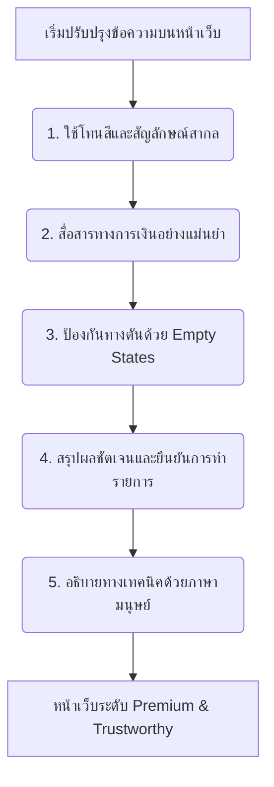

# 🧭 คู่มือและมาตรฐานการปรับแต่งข้อความฝั่งเว็บ (Web Message Polishing Guide)
*สร้างประสบการณ์ใช้งานบนหน้าเว็บที่สวยงาม ลื่นไหล และสร้างความเชื่อมั่นสูงสุด สำหรับระบบจัดการแก๊ง GANG-MANAGER (FiveM SaaS)*

---

> [!NOTE]  
> เอกสารฉบับนี้เป็นคู่มือมาตรฐานการเกลาข้อความ (Copywriting) และการออกแบบองค์ประกอบข้อมูลฝั่ง **Web Application** เพื่อให้สอดคล้องกับ [คู่มือปรับแต่งข้อความฝั่งบอท (BOT_MESSAGE_POLISHING_GUIDE.md)](file:///c:/Users/Jiwww/Desktop/PROJECTX/docs/BOT_MESSAGE_POLISHING_GUIDE.md) แบบ 100% ป้องกันความสับสนของผู้ใช้ในทุกช่องทาง และช่วยยกระดับภาพลักษณ์ของแพลตฟอร์มให้ดูน่าเชื่อถือ เป็นมืออาชีพ และง่ายต่อการตัดสินใจ

---

## 1. วิสัยทัศน์และโทนเสียงฝั่งเว็บ (Web UX Philosophy & Tone of Voice)

ในขณะที่ Discord Bot ทำหน้าที่เป็นหน่วย **"แจ้งเตือนเชิงรุกและรวดเร็ว (Mobile-First Push Notification)"** หน้าเว็บไซต์คือ **"ศูนย์บัญชาการกลาง (Command Center & Ledger)"** ที่ผู้ใช้เข้ามาจัดการข้อมูลเชิงลึก ดังนั้นการสื่อสารบนเว็บจึงต้องปรับเปลี่ยนโดยยึดหลัก 3 ประการนี้:

*   **เห็นภาพชัดเจนและจัดการได้ง่าย (Highly Visual & Actionable):** หน้าเว็บมีพื้นที่หน้าจอที่กว้างกว่าบอท ควรใช้ประโยชน์จากตาราง ข้อมูลเปรียบเทียบ สีของปุ่ม และ Tooltips เพื่อช่วยอธิบายรายละเอียด แทนการใช้ย่อหน้ายาวเหยียด
*   **ความสมบูรณ์แบบของข้อมูลแบบเรียลไทม์ (Real-time Status & Sync Clarity):** หน้าเว็บต้องระบุชัดเจนเสมอว่าข้อมูลที่แสดงอยู่ถูกซิงค์มาจาก Discord ล่าสุดเมื่อใด และกำลังแสดง "ข้อมูลปัจจุบัน" หรือ "ประวัติย้อนหลัง ณ จุดที่เกิดเหตุการณ์" เพื่อไม่ให้ข้อมูลสับสน
*   **ความเห็นอกเห็นใจและความโปร่งใส (Empathetic & Transparent Billing):** เนื่องจากธุรกรรมการเงินและบิลค่าบริการระดับพรีเมียมมีการโอนเงินจริง ระบบต้องสื่อสารอย่างโปร่งใส มีลำดับขั้นตอนที่แน่นอน และอธิบายทางออกที่เป็นรูปธรรมทันทีเมื่อการตรวจสลิปล้มเหลวหรือเกิดข้อผิดพลาด

---

## 2. กฎเหล็ก 5 ข้อในการเขียนข้อความบนเว็บ (5 Golden Rules for Web Copy)

หากต้องการเขียนคำอธิบาย ข้อความเตือน หรือชื่อปุ่มบนเว็บไซต์ ให้ตรวจสอบผ่านเกณฑ์ 5 ข้อนี้เสมอ:



### 1) ใช้โทนสีและสัญลักษณ์สากลที่ตรงกับระบบบอท (Visual & Color Sync)
*   **ต้องตรงกัน:** สีของ Toast Notifications, ป้ายสถานะ (Badges) และสีพื้นหลัง Modal ต้องสอดคล้องกับระบบบอท เช่น สีเขียวบ่งบอกถึงความสำเร็จ, สีแดงคือการล้มเหลว/ปฏิเสธ, และสีส้มบ่งบอกถึงการรอตรวจสอบ
*   *เหตุผล:* เพื่อสร้างความทรงจำเชิงภาพ (Visual Association) เมื่อผู้ใช้สลับหน้าจอไปมาระหว่าง Discord และ Web Dashboard

### 2) สื่อสารความหมายทางการเงินอย่างเป๊ะ (Strict Terminology Rules)
*   **เงินกองกลาง (Treasury):** หมายถึงยอดเงินสะสมในคลังแก๊งในเกม ห้ามสับสนกับเงินส่วนตัวของสมาชิก
*   **ยอดค้างเรียกเก็บ (Accounts Receivable/Due):** ห้ามนำยอดค้างจ่ายค่าธรรมเนียมแก๊งไปรวมเข้ากับ "ยอดทรัพย์สินสุทธิ" หรือโชว์ว่าเงินเข้าแล้วเด็ดขาด ให้แสดงป้ายสถานะ `⏳ รอชำระ` หรือ `🔴 ค้างจ่าย` ชัดเจน
*   **บิลค่าบริการเว็บ (Platform Billing):** การจ่ายเงินสมัครบริการระบบ (SaaS Plan) ให้แยกออกจากธุรกรรมการเงินในเกมอย่างชัดเจน ห้ามใช้คำปะปนกันเพื่อไม่ให้เกิดกรณีสับสนว่ากำลังชำระเงินจริงหรือทำรายการในเกม

### 3) ห้ามปล่อยให้ผู้ใช้เจอทางตันเมื่อไม่มีข้อมูล (Actionable Empty States)
*   ❌ **ไม่ดี:** แสดงตารางโล่งๆ พร้อมข้อความ `No data available` หรือ `ไม่พบข้อมูลการทำธุรกรรม`
*   ✅ **ดีกว่า:** ออกแบบ Empty State ที่มีไอคอนสวยงาม อธิบายว่าผู้ใช้ต้องทำอย่างไร และวางปุ่ม Action ทันที
    > 💸 **ยังไม่มีรายการฝาก-ถอนเงินในรอบนี้**
    > *เริ่มสร้างความคล่องตัวทางการเงินให้กับแก๊งของคุณโดยการเพิ่มรายการฝากเงินกองกลางครั้งแรก*
    > 🖱️ `[ ➕ บันทึกฝากเงิน ]`

### 4) ออกแบบข้อความยืนยันและสถานะกำลังประมวลผล (Feedback & Loading States)
*   ทุกครั้งที่ผู้ใช้กดปุ่มบันทึกหรือทำรายการ ต้องเปลี่ยนสถานะปุ่มเป็น `กำลังบันทึกข้อมูล...` หรือ `กำลังประมวลผล...` พร้อมปิดปุ่มชั่วคราวเพื่อป้องกันการกดซ้ำ (Double Submit)
*   เมื่อสำเร็จ ต้องแสดง Toast Success ทันที เช่น `✅ บันทึกประวัติการลาเรียบร้อยแล้ว` ไม่ควรแสดงคำว่า `Success` เปล่าๆ

### 5) ขจัดภาษาโปรแกรมเมอร์และ API Error ลึกๆ (User-Friendly System Error)
*   ❌ **ไม่ดี:** `Error 400: Bad Request (Invalid file format in billingSlip_Url)`
*   ✅ **ดีกว่า:** `🚫 **รูปแบบไฟล์ไม่ถูกต้อง**\n\n*กรุณาอัปโหลดรูปภาพหลักฐานการโอนเงินในรูปแบบไฟล์ JPEG, PNG เท่านั้น หรือป้อนลิงก์รูปภาพจาก Discord/Facebook CDN ที่สมบูรณ์*`

---

## 3. ระบบสี ป้ายสถานะ และสัญลักษณ์บนหน้าเว็บ (Web Visual Standards)

การวางรูปแบบดีไซน์และโทนสีให้เป็นหนึ่งเดียวกันทั้งระบบ ช่วยลดภาระทางความคิด (Cognitive Load) ของผู้ใช้ได้อย่างดีเยี่ยม:

### 🟢 3.1 มาตรฐานการใช้สีและป้ายสถานะ (Badge & Toast Colors)

| ประเภทข้อมูล | ตัวแทนความหมาย | รหัสสี Tailwind CSS | ตัวอย่างการประยุกต์ใช้บนเว็บ |
| :--- | :--- | :--- | :--- |
| **สำเร็จ / ผ่านการตรวจสอบ** | อนุมัติการลา, อัปโหลดสลิปผ่าน, ซิงค์ข้อมูลสำเร็จ | `bg-emerald-500/10 text-emerald-400 border-emerald-500/20` | Badge `✅ อนุมัติแล้ว` ในตารางส่งวันลา, Toast `สำเร็จ` |
| **รอการดำเนินการ / อยู่ระหว่างตรวจ** | รอฝ่ายบัญชีตรวจสลิปโอนเงิน, รอแอดมินยืนยันยอดเงิน | `bg-amber-500/10 text-amber-400 border-amber-500/20` | Badge `⏳ รอตรวจสอบ` ในประวัติการโอนเงินและบิลค่าบริการ |
| **ปฏิเสธ / ล้มเหลว / ค้างชำระ** | สลิปไม่ถูกต้อง, ค้างค่าธรรมเนียมแก๊งเกินกำหนด | `bg-rose-500/10 text-rose-400 border-rose-500/20` | Badge `🔴 ค้างจ่าย` ในตารางบัญชี, ปุ่ม Danger Zone |
| **ข้อมูลทั่วไป / ดำเนินการต่อ** | ปุ่มแก้ไข, ข้อมูลโปรไฟล์, การเข้าสู่ระบบ | `bg-indigo-500/10 text-indigo-400 border-indigo-500/20` | ปุ่ม `แก้ไขโปรไฟล์`, ป้ายสถานะแผนใช้งาน `Premium` ที่ Header |

### 🧭 3.2 สัญลักษณ์ UI (Web UI Icons & Embellishments)

เพื่อให้อ่านง่ายในระบบ Dashboard เมนูหรือข้อมูลที่มีความหนาแน่นสูง (Dense Elements) ควรมีสัญลักษณ์นำหน้าเสมอ:

*   📊 **Dashboard Overview:** แสดงภาพรวม ข้อมูลทางสถิติที่สำคัญ
*   👥 **Members Roster:** รายชื่อสมาชิก การซิงค์สิทธิ์และยศ
*   💸 **Finance Hub:** ธุรกรรมการเงินกองกลาง ปลอดยอดบิลค่าบริการจริง
*   📝 **Attendance Records:** ระบบเช็คชื่อ สรุปข้อมูลประวัติตอนปิดรอบ
*   ⏳ **Leave Approvals:** รายการขอลาพักร้อนที่อยู่ระหว่างรอพิจารณา
*   💳 **Billing Details:** หน้าชำระค่าบริการระบบ วิธีการอัปโหลดไฟล์/ลิงก์
*   ⚙️ **System Settings:** จัดการบทยศ ช่องแจ้งเตือน Discord และฟังก์ชันขั้นสูง

---

## 4. ตารางเปรียบเทียบก่อน-หลัง ปรับแต่งฝั่งเว็บ (Before vs After)

ตัวอย่างการนำหลักเกณฑ์การเขียนคำพูดและปรับปรุงการจัดวางมาปรับปรุงระบบ Dashboard จริง:

### 📍 ตัวอย่างที่ 1: ระบบชำระค่าบริการและหลักฐานการโอนเงิน (Billing System)
> **ปัญหาข้อความเดิม:** หากส่งสลิปแล้วแอดมินไม่ยอมรับ (Rejected) จะแจ้งแค่คำสั้นๆ โดยไม่บอกสาเหตุและปล่อยให้ผู้ใช้หาสลิปใหม่ไม่ได้

| แบบเดิม (Before Polish) ❌ | แบบใหม่ (After Polish) ✅ | เหตุผลการเปลี่ยนแปลง |
| :--- | :--- | :--- |
| **สถานะบิล: Rejected**<br><br>ใบเสร็จนี้ถูกปฏิเสธโดยแอดมิน<br><br>กรุณาสร้างบิลใหม่ | 💳 **สถานะการชำระเงิน: สลิปไม่ผ่านการตรวจสอบ**<br><br>**สาเหตุที่ปฏิเสธ:** *"ยอดเงินในสลิปไม่ตรงกับยอดเรียกเก็บจริงในระบบ"*<br><br>💡 **แนวทางแก้ไข:**<br>1. ท่านสามารถส่งรูปภาพสลิปที่ถูกต้องใหม่อีกครั้งโดยใช้ปุ่มด้านล่าง<br>2. หากคิดว่าเกิดข้อผิดพลาดกรุณาแจ้งแอดมินเซิร์ฟเวอร์หลัก<br><br>*(ระบบยังคงเปิดบิลนี้อยู่ ไม่จำเป็นต้องทำรายการสร้างบิลใหม่)* | 1. **รักษาประวัติการชำระเงิน:** ระบุชัดเจนว่ารายการยังอยู่ ไม่ได้ถูกยกเลิกเพื่อลดความกังวลใจ<br>2. **อธิบายที่มา:** ระบุสาเหตุที่แอดมินปฏิเสธสลิปนั้นๆ<br>3. **บอกแนวทางแก้ไข:** ให้ช่องทางในการลองใหม่อีกครั้งทันที |

### 📍 ตัวอย่างที่ 2: หน้าจัดการสมาชิกและการซิงค์ยศ Discord (Member Roster & Sync)
> **ปัญหาข้อความเดิม:** ตัวอักษรรก มีคำศัพท์ทางเทคนิคเยอะ และข้อมูลมือถือพังไม่มีการย่อโครงสร้าง

| แบบเดิม (Before Polish) ❌ | แบบใหม่ (After Polish) ✅ | เหตุผลการเปลี่ยนแปลง |
| :--- | :--- | :--- |
| **จัดการตารางสมาชิก**<br>Sync status: true<br>Role mapping successfully loaded.<br>Total active array elements: 42<br>ค้างจ่ายเงิน: 5000 | 👥 **รายชื่อสมาชิกในแก๊ง**<br><br>*   **สมาชิกทั้งหมด:** `42 คน` (ซิงค์ข้อมูลกับ Discord อัตโนมัติ)<br>*   **สถานะการเชื่อมต่อบอท:** `🟢 เชื่อมต่อปกติ`<br><br>💰 **สรุปยอดเงินค้างชำระกองกลาง:**<br>*   มีสมาชิกค้างชำระค่าปรับ/ค่าธรรมเนียม: `1 คน`<br>*   ยอดค้างชำระรวม: `5,000 EXP` *(ดูรายละเอียดได้ที่แถวที่มีการแจ้งเตือน)* | 1. **ขจัด Tech Jargon:** เปลี่ยนจาก `Array elements` หรือ `Sync status: true` เป็นภาษาคน<br>2. **จัดลำดับความสำคัญ:** เน้นตัวเลขที่ต้องรู้ทันที (จำนวนสมาชิก และจำนวนค้างชำระ)<br>3. **ใส่ Comma:** เพิ่ม `,` และตัวย่อสกุลเงินกองกลางให้อ่านง่าย |

### 📍 ตัวอย่างที่ 3: แบบฟอร์มขอลาหยุดงาน (Leave Request Modal Form)
> **ปัญหาข้อความเดิม:** ไม่มีคู่มือบอกว่าส่งข้อมูลไปแล้วจะเกิดอะไรขึ้น และใช้วันที่แบบคอมพิวเตอร์ที่ไม่ได้คำนวณวันรวม

| แบบเดิม (Before Polish) ❌ | แบบใหม่ (After Polish) ✅ | เหตุผลการเปลี่ยนแปลง |
| :--- | :--- | :--- |
| **Leave Form**<br>Start: 2026-05-21<br>End: 2026-05-23<br>Reason: [ ] | 📝 **คำขออนุมัติลางาน**<br><br>กรุณาระบุข้อมูลวันที่ที่ต้องการหยุดปฏิบัติงานในระบบ:<br><br>*   **ระยะเวลาหยุดงาน:** วันที่ `21 พ.ค.` ถึง `23 พ.ค. 2026`<br>    *(รวมระยะเวลาทั้งหมด **3 วัน**)*<br>*   **ผลต่อสถิติ:** เมื่อคำขอนี้ได้รับการอนุมัติ ท่านจะไม่ถูกระบบหักเงินค่าปรับเช็คชื่อในช่วงเวลาดังกล่าว<br><br>*ข้อมูลคำขอนี้จะถูกส่งตรงไปยังห้องแอดมินบน Discord ทันที* | 1. **คำนวณวันให้เห็น:** ช่วยลดความผิดพลาดของการนับวันโดยประมวลผลให้ผู้ใช้ดูแบบสดๆ<br>2. **สร้างความสบายใจ:** อธิบายเหตุและผลว่าการลาครั้งนี้ช่วยรักษาสิทธิอย่างไรเพื่อลดดราม่า |

---

## 5. คู่มือจำแนกรายโมดูลฝั่งเว็บ (Web Module Copywriting & UI Polish)

### 5.1 ระบบการเงินและบัญชีกองกลาง (Gang Finance Hub)
การจัดการเงินในแก๊งต้องระมัดระวังเป็นพิเศษเพื่อให้หัวหน้าแก๊งและสมาชิกมีความโปร่งใสทางบัญชีสูงสุด:
*   **การกรอกข้อมูลธุรกรรม (Transaction Input):**
    *   ฟิลด์อินพุตตัวเลขต้องมีตัวแปลงจุลภาคอัตโนมัติ (Auto-comma formatter) ระหว่างผู้ใช้พิมพ์
    *   มีข้อความกำกับเบาๆ (Helper text) ใต้ช่องกรอกข้อมูล เช่น *"ยอดเงินที่คุณกรอกจะถูกบันทึกเข้าระบบกองกลางทันที ไม่สามารถแก้ไขย้อนหลังได้โดยไม่ผ่านการรับรองจากหัวหน้าฝ่ายการเงิน"*
*   **การแสดงข้อมูลยอดค้างจ่าย (Debts & Accounts Receivable):**
    *   ห้ามปะปนกับกระแสเงินสดจริง ให้ระบุว่าเป็นยอดเงินที่ **"รอการจัดเก็บ (Pending Collection)"** เสมอ

### 5.2 ระบบสถิติและประวัติการเช็คชื่อ (Attendance History)
ระบบเช็คชื่อมีผลประโยชน์เรื่องสิทธิประโยชน์และการถูกลงโทษในเกม จึงต้องแสดงข้อมูลประวัติที่มีความเที่ยงตรง:
*   **ประวัติแบบ Snapshot เสมอ (Historical Records):**
    *   เมื่อแสดงสถิติประวัติรอบเช็คชื่อที่ปิดไปแล้ว ต้องแสดงข้อความเตือนให้ชัดเจน:
        > 📊 **หมายเหตุประวัติ:** รายการประวัติเช็คชื่อนี้ใช้ข้อมูลบันทึกแบบตรึง ณ เวลาที่ปิดรอบคำขอ สถิตินี้จะไม่เปลี่ยนตามชื่อ Discord หรือการลาออกของสมาชิกปัจจุบัน
*   **การแสดงผลบนโทรศัพท์มือถือ (Mobile Responsive):**
    *   ข้อมูลตารางประวัติบนมือถือ ห้ามใช้สไลด์บาร์เลื่อนแนวนอนมากจนเกินไป ให้แปลงตารางสรุปเป็นรูปแบบ **การ์ดข้อมูลแบบย่อ (Compact Visual Cards)**

### 5.3 หน้าตั้งค่าและจัดการบทยศ (Role Sync & Settings)
ช่วยให้แอดมินหรือหัวหน้าแก๊งไม่สับสนกับการผูกระบบบอทเข้ากับ Discord Guild:
*   **คู่มือความช่วยเหลือใต้เมนูบทยศ (Helper Cards):**
    *   เนื่องจากหัวหน้าแก๊งส่วนใหญ่มักลืมตั้งค่าตำแหน่งบอทให้อยู่ "สูงสุด" ใน Discord Server แนะนำให้วางข้อความสำคัญ:
        > [!IMPORTANT]  
        > **ตำแหน่งยศของบอทมีความสำคัญเป็นอันดับหนึ่ง!**  
        > เพื่อให้บอทสามารถมอบยศหรือถอนยศสมาชิกในดิสคอร์ดได้สำเร็จ กรุณาลากบทยศชื่อ `GANG-MANAGER` บนเซิร์ฟเวอร์ Discord ของคุณให้อยู่ **สูงกว่า** บทบาทของสมาชิกทั่วไปเสมอ

---

## 6. แนวทางการระบุข้อผิดพลาดบนหน้าเว็บ (Web Error Copywriting & Inline Validation)

เมื่อ API ส่ง Error กลับมาที่หน้าบราวเซอร์ หน้าที่หลักคือ **"การแปลภาษาเครื่องเป็นภาษามนุษย์ที่มีความเข้าใจและอบอุ่น"** เสมอ:

| ปัญหาทางเทคนิคที่พบ | ข้อความที่ส่งมาจากเซิร์ฟเวอร์ ❌ | ข้อความและคำแนะนำที่เกลาแล้วบนหน้าเว็บ ✅ |
| :--- | :--- | :--- |
| **เซสชันผู้ใช้หมดอายุ** | `Error: Unauthorized (401). Token expired.` | 🔐 **เซสชันการเข้าสู่ระบบของคุณหมดอายุแล้ว**<br><br>กรุณากดปุ่ม **[ 🚪 เข้าสู่ระบบใหม่อีกครั้ง ]** เพื่อซิงค์สิทธิการทำงานจาก Discord และเพื่อความปลอดภัยของข้อมูลแก๊งของคุณ |
| **อัปโหลดภาพขนาดใหญ่เกินไป** | `Payload Too Large (413). Upload size limit exceeded.` | 🚫 **ไฟล์รูปภาพหลักฐานโอนเงินมีขนาดใหญ่เกินกำหนด**<br><br>ระบบรอบรับไฟล์ภาพขนาดไม่เกิน **`5 MB`** เท่านั้น<br>💡 *แนะนำ: บีบอัดรูปภาพลง หรือแคปเจอร์หน้าจอใหม่อีกครั้งเพื่อลดขนาดไฟล์* |
| **การเชื่อมต่อฐานข้อมูลขัดข้อง** | `Prisma Client Connection pool timeout error.` | 🔌 **ไม่สามารถติดต่อบริการหลักได้ชั่วคราว**<br><br>ระบบกำลังพยายามกู้คืนการทำงานอัตโนมัติ<br>💡 *ทางออก: กรุณารอสักครู่แล้วลองกดทำรายการใหม่อีกครั้ง หรือหากยังพบปัญหานี้สามารถติดต่อฝ่ายซัพพอร์ตของแพลตฟอร์ม* |

---

## 7. แบบฟอร์มมาตรฐานสำหรับการเขียนข้อความหน้าเว็บและ UI (Web UX Copywriting Template)
*(แจกจ่ายให้ทีมพัฒนาใช้ตอนออกแบบ Component หรือเขียนคำอธิบายระบบในอนาคต)*

```markdown
### [ 🖥️ ร่างการวางข้อมูล: ชื่อหน้าเว็บ / ชื่อฟอร์ม Modal ]

1. **วัตถุประสงค์ของเมนู/หน้าจอนี้:** (เช่น หน้าให้แอดมินยกเลิกการลาพักร้อนย้อนหลัง)
2. **ตำแหน่งและประเภท UI:** [Toast Notification | Modal Dialog | Inline Alert | Tooltip | Table Column]
3. **การเลือกใช้โทนสีของสถานะ:** [Success Green | Danger Red | Warning Orange | Info Blue]
4. **ร่างข้อความภาษาเกลา (Markdown Format):**
   [ใส่สัญลักษณ์ UI] **[หัวข้อหลักที่กระชับและมองเห็นทันที]**
   
   [คำอธิบายอภิปรายเหตุผลหรือกฎข้อตกลง 1-2 บรรทัด]
   
   📊 **สรุปรายละเอียดข้อมูล:**
   *   รายการที่ 1: `[ตัวเลข/ข้อความในระบบ]`
   *   รายการที่ 2: `[ตัวเลข/ข้อความในระบบ]`
   
   💡 **ข้อเสนอแนะหรือขั้นตอนถัดไป (Next Step):**
   *   [บอกชัดเจนว่าผู้ใช้ควรไปหน้าไหนต่อ หรือต้องกดยืนยันอย่างไร]
   
5. **ข้อความบนปุ่ม Action (Buttons CTA):**
   *   `[ 🟢 อนุมัติการดำเนินการ ]` -> (สีหลัก / ชี้จุดประสงค์)
   *   `[ ⚪ ยกเลิก ]` -> (สีเทา / ปิดกล่องข้อความปลอดภัย)
```

---

> [!TIP]  
> ระบบ Dashboard ที่ดี ไม่ได้ขึ้นอยู่กับจำนวนปุ่มที่เยอะหรือฟีเจอร์ที่ซับซ้อน แต่ขึ้นอยู่กับ **"การทำให้ผู้ใช้งานเข้าใจได้ทันทีโดยไม่ต้องผ่านคู่มือฉบับใหญ่"** การเกลาข้อความให้กระชับ ชี้จุดชัดเจน และไม่สับสน จะเปลี่ยนเครื่องมือใช้งานให้กลายเป็นที่รักของทุกแก๊งอย่างยั่งยืน!
